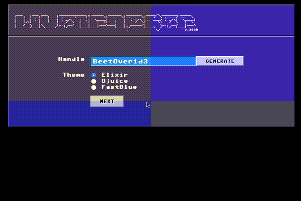

# LiveTracker

```
.___    .___ .___     .____________._.______  .______  ._______ .____/\ ._______.______
|   |   : __||   |___ : .____/\__ _:|: __   \ :      \ :_.  ___\:   /  \: .____/: __   \
|   |   | : ||   |   || : _/\   |  :||  \____||   .   ||  : |/\ |.  ___/| : _/\ |  \____|
|   |/\ |   ||   :   ||   /  \  |   ||   :  \ |   :   ||    /  \|     \ |   /  \|   :  \
|   /  \|   | \      ||_.: __/  |   ||   |___\|___|   ||. _____/|      \|_.: __/|   |___\
|______/|___|  \____/    :/     |___||___|        |___| :/      |___\  /   :/   |___|
                                                        :            \/             v.3030
```

Entry for [Phoenix Phrenzy](https://phoenixphrenzy.com) contest.

First there was Amiga [ProTracker](https://en.wikipedia.org/wiki/ProTracker),
then DOS [FastTracker](https://en.wikipedia.org/wiki/FastTracker_2),
and now [LiveView](https://github.com/phoenixframework/phoenix_live_view) **LiveTracker**.



## Phrenzy Instructions

Fork this repo and start build an application! See [Phoenix Phrenzy](https://phoenixphrenzy.com) for details.

Note: for development, you'll need Elixir, Erlang and Node.js. If you use the [asdf version manager](https://github.com/asdf-vm/asdf) and install the [relevant plugins](https://asdf-vm.com/#/plugins-all?id=plugin-list), you can install the versions specified in `.tool-versions` with `asdf install`.

## Deployment

How you deploy your app is up to you. A couple of the easiest options are:

- Heroku ([instructions](https://hexdocs.pm/phoenix/heroku.html))
- [Gigalixir](https://gigalixir.com/) (doesn't limit number of connections)

## The Usual README Content

To start your Phoenix server:

- Install dependencies with `mix deps.get`
- Create and migrate your database with `mix ecto.setup`
- Install Node.js dependencies with `cd assets && npm install`
- Start Phoenix endpoint with `mix phx.server`

Now you can visit [`localhost:4440`](http://localhost:4440) from your browser.

Ready to run in production? Please [check our deployment guides](https://hexdocs.pm/phoenix/deployment.html).

## Learn more

- Official website: http://www.phoenixframework.org/
- Guides: https://hexdocs.pm/phoenix/overview.html
- Docs: https://hexdocs.pm/phoenix
- Mailing list: http://groups.google.com/group/phoenix-talk
- Source: https://github.com/phoenixframework/phoenix
